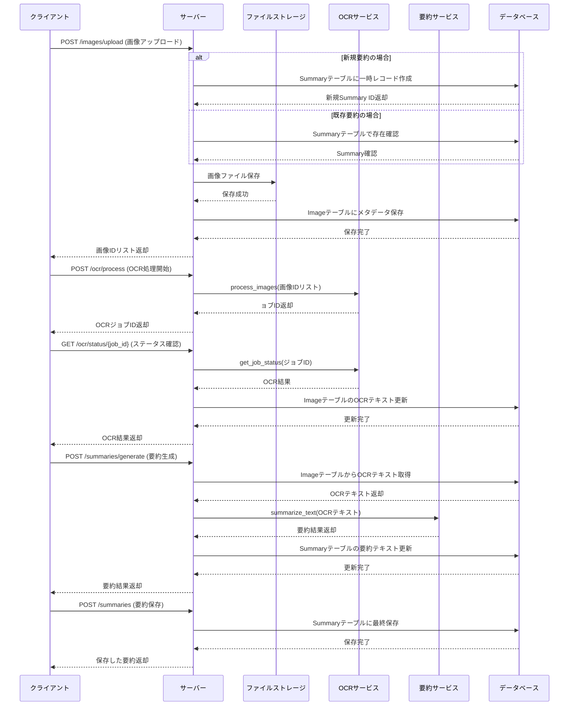

```mermaid
sequenceDiagram
    participant Client as クライアント
    participant Server as サーバー
    participant Storage as ファイルストレージ
    participant OCRService as OCRサービス
    participant SummaryService as 要約サービス
    participant DB as データベース

    Client->>Server: POST /images/upload (画像アップロード)
    alt 新規要約の場合
        Server->>DB: Summaryテーブルに一時レコード作成
        DB-->>Server: 新規Summary ID返却
    else 既存要約の場合
        Server->>DB: Summaryテーブルで存在確認
        DB-->>Server: Summary確認
    end
    Server->>Storage: 画像ファイル保存
    Storage-->>Server: 保存成功
    Server->>DB: Imageテーブルにメタデータ保存
    DB-->>Server: 保存完了
    Server-->>Client: 画像IDリスト返却

    Client->>Server: POST /ocr/process (OCR処理開始)
    Server->>OCRService: process_images(画像IDリスト)
    OCRService-->>Server: ョブID返却
    Server-->>Client: OCRジョブID返却

    Client->>Server: GET /ocr/status/{job_id} (ステータス確認)
    Server->>OCRService: get_job_status(ジョブID)
    OCRService-->>Server: OCR結果
    Server->>DB: ImageテーブルのOCRテキスト更新
    DB-->>Server: 更新完了
    Server-->>Client: OCR結果返却

    Client->>Server: POST /summaries/generate (要約生成)
    Server->>DB: ImageテーブルからOCRテキスト取得
    DB-->>Server: OCRテキスト返却
    Server->>SummaryService: summarize_text(OCRテキスト)
    SummaryService-->>Server: 要約結果返却
    Server->>DB: Summaryテーブルの要約テキスト更新
    DB-->>Server: 更新完了
    Server-->>Client: 要約結果返却

    Client->>Server: POST /summaries (要約保存)
    Server->>DB: Summaryテーブルに最終保存
    DB-->>Server: 保存完了
    Server-->>Client: 保存した要約返却
```